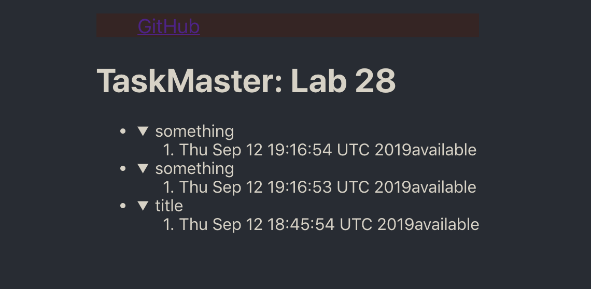

## lab 27 DynamoDB and AWS
- Author: Jack Daniel Kinne, Sapana Poudel, Peter Lee
- Challenge by: Codefellows.
<!-- Short summary or background information -->
- write a complete model, with get, put, and post routes below:

## links:
- [Frontend](http://taskmaster-frontend-jack.s3-website-us-west-2.amazonaws.com/)
- [Backend](http://taskmaster1-dev.us-west-2.elasticbeanstalk.com/api1/v2/tasks)
- 

## Challenge
<!-- Description of the challenge -->
- Users should be able to upload images that are associated with tasks.
This ability should be at a route like POST /tasks/{id}/images. (This means it only needs to work for existing tasks, not as part of the initial creation of a task.)
Your server should programmatically upload this image to S3.
Your server should store the image URL (on S3) somewhere in its database, associated with the task.
Fetching a single task (at GET /tasks/{id}) should also include the image URLs associated with that image.

- A user should be able to make a GET request to /tasks and receive JSON data representing all of the tasks.
Each task should have a title, description, assignee, and status, all of which are strings, as well as an id.
- A user should be able to make a GET request to /users/{name}/tasks and receive JSON data representing all of the tasks assigned to that user.
This should work (i.e. return an empty array) if the requested username does not have any assigned tasks.
- A user should be able to make a POST request to /tasks with body parameters for title, description, and assignee to add a new task.
- A task should start with a status of Available if there is no assignee, and Assigned if there is an assignee.
- The response to that request should contain the complete saved data for that task.
- It should not matter whether or not that assignee is already in the database.
- A user should be able to make a PUT request to /tasks/{id}/state to advance the status of that task.
- Tasks should advance from Available -> Assigned -> Accepted -> Finished.
- A user should be able to make a PUT request to /tasks/{id}/assign/{assignee} to assign a particular user to a task.
- Changing the assignee should set the task’s state to Assigned.
- This should work whether or not that assignee name is already in the database.
- A user should be able to access this application on the Internet.
- The application should be deployed to EC2, with the database on DynamoDB.
- You should also use DynamoDB for your local application testing; in other words, you should connect to your production database, even in your development environment. (This is generally a bad practice, and we’ll see how to work differently soon.)

## credits and contributions
- Brandon Hurrington
- Matthew Stuhring
- Chris Coulton
- Melfi Perez

